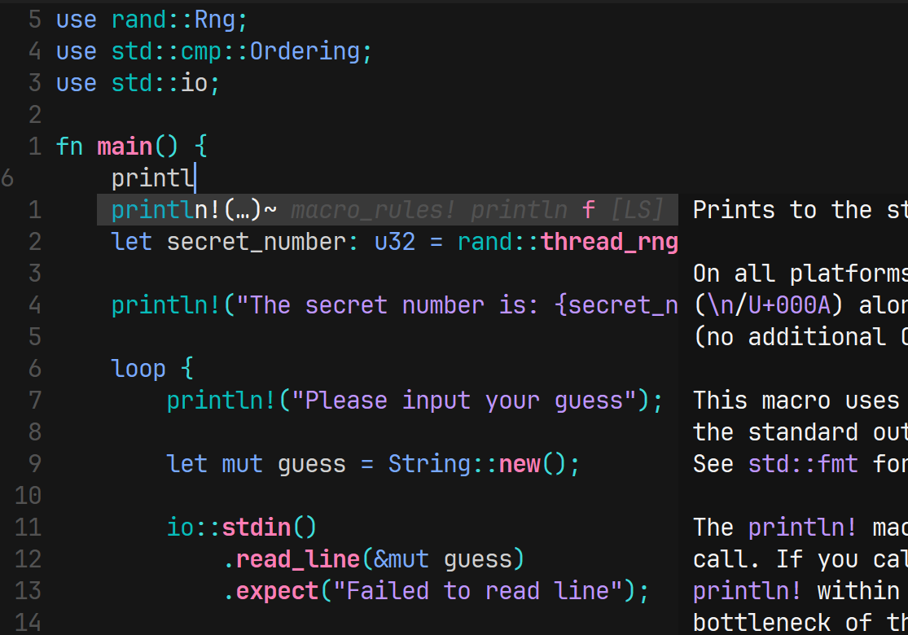

# Ivu.nvim
This is a minimalistic config made to just get you into the zone of coding  
for Neovim 0.9.1+

## Dependencies
- nodejs
- npm
- A nerd font
- git
- lazygit
- A C compiler in path

## Theme 
Oxocarbon

## Plugins used
- plenary
- telescope
- web-devicons
- treesitter
- harpoon
- oil
- toggleterm
- eyeliner
- coc
- transparency
