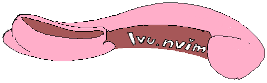

<h1 align="center"> Ivu.nvim </h1>
<p align="center"></p>
<h5 align="center"><sub>made with mspaint :3</sub></h5>

---

<p align="center">This is a personal minimalistic config made to just get you into the zone of coding  
for Neovim 0.10+ </p> 
<h2>Features </h2>
<ul>
  <li>File searching with telescope</li>
  <li>Convinient file exploring with Oil</li>
  <li>Quick tab switching with harpoon</li>
  <li>Quick line navigation with eyeliner</li>
</ul>

## **Dependencies**
- [A nerd font](https://www.nerdfonts.com/)
- [git](https://git-scm.com/)
- [lazygit](https://github.com/jesseduffield/lazygit)
- [gcc](https://gcc.gnu.org/)
- [grep]()


## **Installation**
- for linux/mac user  
```
$ git clone https://github.com/Lain62/Ivu.nvim ~/.config/nvim --depth 1
```
   
- for windows user
```
$ git clone https://github.com/Lain62/Ivu.nvim $HOME\AppData\Local\nvim --depth 1
```

## **Default settings**
```
Options:
  opt.nu = true
  opt.relativenumber = true
  opt.scroloff = 8
  opt.shiftwidth = 4

keybindings:
   <leader>   = " " (spacebar)
  <leader>pv  = Open oil File explorer
      J       = Move selected lines down
      K       = Move selected lines up
    <C-j>     = Half page down
    <C-k>     = Half page up
  <leader>g   = Open Lazygit
  <leader>pf  = Open find telescope
  <leader>pg  = Open find git telescope
  <leader>pb  = Open find buffer telescope
  <leader>ps  = Open grep telescope
  <leader>h   = Open harpoon file manager
  <leader>1   = Harpoon tab 1
  <leader>2   = Harpoon tab 2
  <leader>3   = Harpoon tab 3
  <leader>4   = Harpoon tab 4
    <C-t>     = Toggle terminal
```

## **Plugins**
- [Lazy.nvim](https://github.com/folke/lazy.nvim)
- [oxocarbon.nvim](https://github.com/nyoom-engineering/oxocarbon.nvim)
- [plenary.nvim](https://github.com/nvim-lua/plenary.nvim)
- [telescope.nvim](https://github.com/nvim-telescope/telescope.nvim)
- [nvim-web-devicons](https://github.com/nvim-tree/nvim-web-devicons)
- [nvim-treesitter](https://github.com/nvim-treesitter/nvim-treesitter)
- [harpoon](https://github.com/ThePrimeagen/harpoon)
- [oil.nvim](https://github.com/stevearc/oil.nvim)
- [eyeliner.nvim](https://github.com/jinh0/eyeliner.nvim)
- [numb.nvim](https://github.com/nacro90/numb.nvim)
- [vim-visual-multi](https://github.com/mg979/vim-visual-multi)
